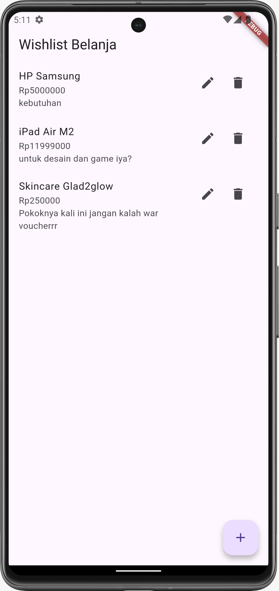
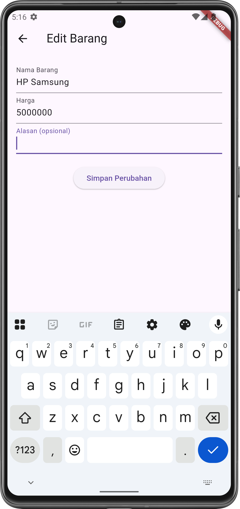
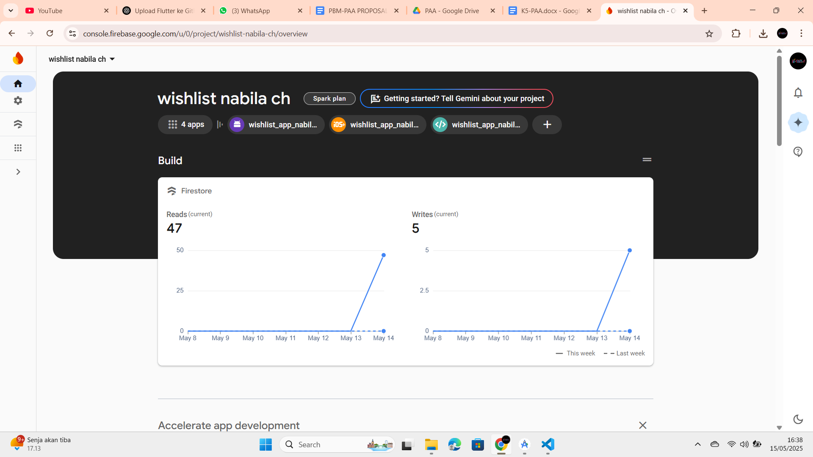
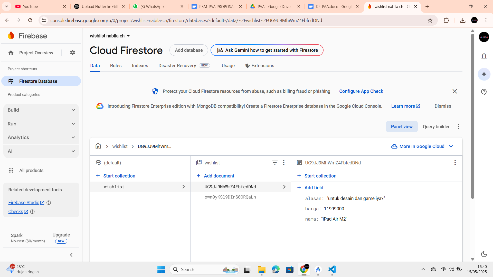
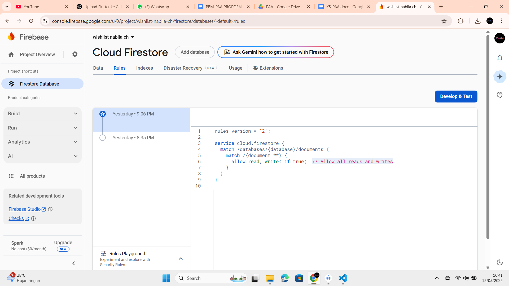
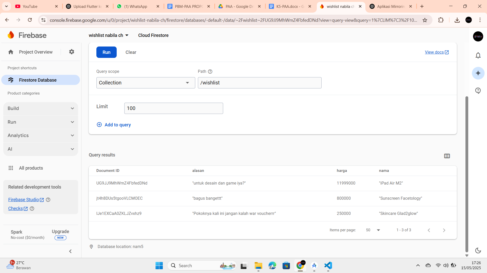

# 📌 Wishlist App Nabila

Nama    : Nabila Choirunisa
Kelas   : PBM B
NIM     : 232410102059

Aplikasi Flutter sederhana yang mengimplementasikan fitur **CRUD (Create, Read, Update, Delete)** menggunakan **Firebase Firestore**.

## 🔧 Fitur
- Tambah wishlist baru
- Lihat daftar wishlist
- Edit wishlist
- Hapus wishlist

## ☁️ Integrasi Firebase

Aplikasi ini terhubung dengan **Firebase Firestore** menggunakan:
- `cloud_firestore` package
- File konfigurasi Firebase di `firebase_options.dart`

Firebase digunakan sebagai database cloud real-time untuk menyimpan data wishlist pengguna (tanpa login).

## 📸 Screenshot

### Halaman Daftar Wishlist


### Form Tambah Wishlist


### Edit Wishlist



### Hapus Wishlist


## 🛠️ Teknologi yang Digunakan
- Flutter
- Firebase Firestore (tanpa login)





## ▶️ Cara Menjalankan Aplikasi

```bash
flutter pub get
flutter run


## Getting Started

This project is a starting point for a Flutter application.

A few resources to get you started if this is your first Flutter project:

- [Lab: Write your first Flutter app](https://docs.flutter.dev/get-started/codelab)
- [Cookbook: Useful Flutter samples](https://docs.flutter.dev/cookbook)

For help getting started with Flutter development, view the
[online documentation](https://docs.flutter.dev/), which offers tutorials,
samples, guidance on mobile development, and a full API reference.
